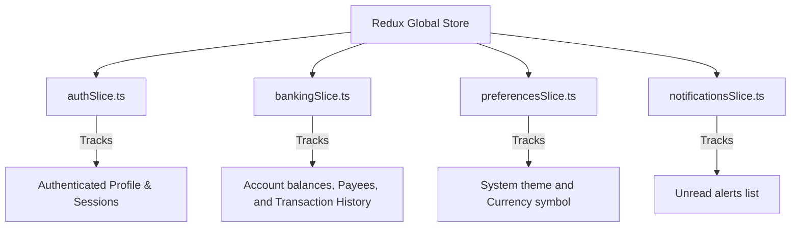

# FinVerse Feature & Screen Documentation Guide

Welcome to the comprehensive feature and architecture documentation for **FinVerse**, a premium Wealth Management and Digital Banking Ecosystem. This document details each page, component, and global setting, outlining **what** is on the screen, **why** it is required, and the **business/technical use** of each element.

---

## 🎨 Design System & Aesthetics Philosophy

Before diving into individual screens, it is essential to understand the visual choices governing the FinVerse experience.

*   **Mesh Ambient Gradient Blobs**: The background utilizes fixed, blurred, floating color blobs (Cyan, Purple, Pink) that animate in the background.
    *   *Why required*: Standard flat interfaces look generic. Mesh gradients combined with backdrop blurs (glassmorphism) create a premium, high-fidelity aesthetic that increases user engagement and trust in a wealth platform.
*   **Typography Overrides**: Outfit font is utilized for headings and numerical balances, while Inter is utilized for body text, form labels, and table grids.
    *   *Why required*: The Outfit font has clean, geometric characters that look highly modern and readable at large sizes. Inter provides excellent legibility for smaller labels, currency ledgers, and transaction values.
*   **Dual Mode Themes**: Seamless toggling between a low-light Dark Mode and a high-contrast Light Mode.
    *   *Why required*: Offers accessibility for users in different lighting conditions and meets modern web design standards.

---

## 📱 Global Application Shell (AppLayout)

The [AppLayout.tsx](file:///e:/FinVerse/Front%20End/FinVerse/src/components/layout/AppLayout.tsx) serves as the persistent layout wrapper for all authenticated screens. It acts as the navigation hub.

### 1. Top Header Navigation Bar
*   **What is there**:
    *   **Responsive Page Title**: Adapts depending on the active path (e.g., displaying "Overview" for Dashboard, "Transaction Ledger" for history).
    *   **Responsive Menu Toggler**: Visible only on mobile screens to toggle the sidebar drawer.
    *   **Theme Toggle**: A quick button to switch the application theme (Sun/Moon icon).
    *   **Notification Icon (Badge)**: Displays a count of unread alerts (sends notifications to Redux). Clicking opens the Notification Popover.
    *   **User Avatar Dropdown**: Displays the user's Dicebear avatar and membership tier. Clicking opens a dropdown menu with shortcuts to Profile, Settings, and Logout.
*   **Why required**: Provides immediate access to security alerts, settings, and profile controls from any screen without interrupting the user's active flow.
*   **Use of elements**:
    *   *Theme switch*: Updates the MUI ThemeProvider state instantly.
    *   *Notification badge*: Real-time indicator of security breaches or transfer settlements.
    *   *Avatar dropdown*: Speeds up navigation to configuration panels.

### 2. Desktop Sidebar
*   **What is there**:
    *   **Brand Header**: Shows the glowing FinVerse logo and "Wealth Ecosystem" sub-label.
    *   **Banking Module Links**: Active links to Dashboard, Accounts, Beneficiaries, Fund Transfer, Transactions, and Statements.
    *   **Future Module Locks**: Visually lists locked routes (Trading Hub, Insurance, Risk Intel) with a "LOCKED" indicator.
    *   **Logout Button**: Red-accented button at the bottom of the sidebar.
*   **Why required**: Separates the navigation categories clearly, highlighting what features are currently available and what is coming next in the product roadmap.
*   **Use of elements**:
    *   *Locked routes*: Clicking these triggers an in-app notification explaining that these features will unlock in Release 2. This keeps the complete product vision in front of the user.
    *   *Logout button*: Clears the auth slice state and redirects back to the login screen.

### 3. Mobile Bottom Navigation
*   **What is there**: A sticky bottom menu containing four quick buttons: *Overview*, *Accounts*, *Transfer*, and *Profile*.
*   **Why required**: Essential for mobile UX. Reaching the top-left menu button is difficult on modern mobile screens.
*   **Use of elements**: Seamlessly routes the user to core banking tasks with single-tap thumb access.

---

## 🔒 Authentication Pages

Located in `src/pages/auth/`, this module secures access to the platform and registers user details.

### 1. Login Screen
*   **What is there**:
    *   **Credentials Card**: Fields for Email Address and Password with validation states.
    *   **Visibility Toggle**: Eye/EyeOff icons to reveal/hide the password.
    *   **Remember Me & Recovery links**: Directs to the Forgot Password page.
    *   **Quick-Fill Tester Panel**: Visual buttons for `Standard`, `Premium`, and `Wealth` profiles.
*   **Why required**: Controls platform security and provides an entry point for testing the application's different features.
*   **Use of elements**:
    *   *Tester Panel*: Prefills corresponding emails and passwords, allowing you to instantly sign in and verify the visual styling of different account tiers.

### 2. Register Screen
*   **What is there**:
    *   **Registration Card**: Inputs for Name, Email, Password, and Membership Tier.
    *   **Membership Card Selector**: Grid cards detailing pricing and benefits for three tiers:
        1.  *Standard ($0/mo)*: Basic banking and transfers.
        2.  *Premium ($9.99/mo)*: Priority clearing, metal card access.
        3.  *Wealth ($29.99/mo)*: Advanced portfolio analytics and advisory locks.
*   **Why required**: Collects user details and determines initial credit limits, interest rates, and access permissions.
*   **Use of elements**: Clicking a tier card updates the state dynamically, highlighting the selected plan.

### 3. Forgot Password Screen
*   **What is there**:
    *   **Email Field**: Input to submit recovery requests.
    *   **Verification Card (OTP)**: Simulates sending a code once the email is submitted. The interface informs the user that code `4209` has been sent.
*   **Why required**: Simulates the recovery process for password resets.
*   **Use of elements**: Validates the simulated code, directing the user to `/reset-password` upon entry of `4209`.

### 4. Reset Password Screen
*   **What is there**:
    *   **Password Inputs**: Password and Confirm Password text fields.
    *   **Strength Bar Indicator**: A linear progress bar that calculates complexity in real-time, shifting colors:
        *   *Red (0-25%)*: Weak (short length, no numbers/caps).
        *   *Yellow (25-75%)*: Fair (moderate length).
        *   *Green (75-100%)*: Strong (contains mixed cases, numbers, and length >= 10).
*   **Why required**: Protects user accounts by enforcing password strength validation.
*   **Use of elements**: Blocks submissions if the password strength is too low or if fields do not match.

---

## 📊 Core Dashboard

The [Dashboard.tsx](file:///e:/FinVerse/Front%20End/FinVerse/src/pages/dashboard/Dashboard.tsx) provides a consolidated view of the user's financial assets and liabilities.

### 1. Unified Equity Metrics (Stat Cards)
*   **What is there**: Four stat cards representing financial health:
    1.  *Net Worth*: Sum of checking, savings, and investments minus credit and loan balances.
    2.  *Liquid bank balance*: Titanium checking balance.
    3.  *Invested portfolio*: Wealth management balance.
    4.  *Liabilities*: Credit card spend.
*   **Why required**: Users need a high-level summary of their financial position as soon as they log in.
*   **Use of elements**:
    *   *Trend Pills*: Show positive or negative percentage changes.
    *   *Mini SVGs*: Show sparkline trends to help users visualize recent growth at a glance.

### 2. Wealth Growth History (Main Area Chart)
*   **What is there**: A large Recharts Area Chart mapping Consolidated Wealth (filled gradient area) against Total Deposits (dashed line) over the last 6 months.
*   **Why required**: Visualizes long-term financial trends, showing whether the user's net worth is growing relative to their deposits.
*   **Use of elements**: Hovering over the graph displays a tooltip with exact values for each month.

### 3. Risk Assessment Dial
*   **What is there**: A glass circular dial showing a calculated risk percentage (e.g., `28% - Low Risk`) alongside asset mix recommendations.
*   **Why required**: Helps wealth clients verify if their holdings match their target risk tolerance.
*   **Use of elements**: Integrates with the selected membership tier (Standard, Premium, Wealth) to offer personalized allocation tips.

### 4. Asset Insurance Scope
*   **What is there**: A progress bar showing how much of the user's wealth is protected by FDIC limits.
*   **Why required**: Displays coverage safety metrics to give users peace of mind.
*   **Use of elements**: Visualizes coverage percentages (e.g., 85% covered) with a clean progress bar.

### 5. Quick Send Avatars
*   **What is there**: A row of saved payee avatars with initials. Clicking one opens an instant payment modal.
*   **Why required**: Simplifies frequent transfers by removing the need to navigate through the full transfer wizard.
*   **Use of elements**:
    *   *Payment Dialog*: Enter an amount and click "Send" to complete a transfer directly from the dashboard.

---

## 🏦 Banking Modules

Located in `src/pages/banking/`, these screens handle cash, deposits, and payments.

### 1. Account Summary
*   **What is there**:
    *   **Visual Credit Cards**: Glassmorphic credit card mockups displaying carrier logos, chip details, and masked numbers.
    *   **Balance summary**: Lists Checking and Savings details, including interest rates (e.g. Savings APY at 4.25%).
    *   **Repayment tracker**: Progress bars for loans showing principal limits vs repaid percentages.
*   **Why required**: Houses all checking, credit, and loan structures on a single screen.
*   **Use of elements**:
    *   *Details button*: Navigates to the transaction history for a specific account.
    *   *Repayment bar*: Helps users track their loan progress.

### 2. Account Details
*   **What is there**:
    *   **Balance Header**: Displays available balances with action buttons (Send Money and Export CSV).
    *   **Spending Donut Chart**: A Recharts PieChart breaking down current-month expenses by category (e.g., Food & Dining, Shopping, Utilities).
    *   **Transaction Table**: A searchable table of all transactions for this specific account.
*   **Why required**: Provides a detailed breakdown of an individual account's spending habits.
*   **Use of elements**:
    *   *Donut chart cells*: Interactive cells color-coded by category (e.g. Green for Salary, Yellow for Food) to show where the user's money is going.

### 3. Beneficiary Management
*   **What is there**:
    *   **Contacts Search**: Filters saved payees.
    *   **CRUD Forms**: A pop-up dialog to Add, Edit, or Delete payees (requires Name, Account Number, and Bank Name).
    *   **Payee List**: Cards displaying recipient banks, contact emails, and action buttons.
*   **Why required**: Saves recipient account details so users don't have to enter them manually for every transfer.
*   **Use of elements**: Validates inputs to ensure account numbers are numeric before saving.

### 4. Fund Transfer Wizard
*   **What is there**: A multi-step flow that guides the user through a transfer:
    1.  *Select Recipient*: Choose the source account and saved beneficiary.
    2.  *Transfer Details*: Enter the amount, speed (Standard clearing vs Instant settlement), and remarks.
    3.  *Verify*: Authorize the transfer using the simulated OTP code `4209`.
    4.  *Complete*: Displays a success receipt and triggers a confetti animation.
*   **Why required**: Ensures transfers are secure and validated before funds are deducted.
*   **Use of elements**:
    *   *Confetti*: Celebrates successful transfers to create a positive user experience.
    *   *State updates*: Deducts the transfer amount from the source account and adds a record to the transaction history.

### 5. Transaction History
*   **What is there**: A comprehensive list of all transactions across all accounts, with filters for:
    *   *Account*: Filter by checking, savings, or credit card.
    *   *Category*: Filter by category (e.g., Salary, Food, Utilities).
    *   *Flow*: Filter by incoming (deposits) or outgoing (withdrawals).
    *   *Sorting*: Sort by newest first, oldest first, highest amount, or lowest amount.
*   **Why required**: Serves as the main ledger for account reconciliation and expense tracking.
*   **Use of elements**: Clicking a row opens a modal with details like Transaction ID, settled timestamp, and description.

### 6. e-Statements
*   **What is there**:
    *   **Statement Selector**: Dropdown to select a bank account.
    *   **Registry Table**: Lists billing statements by month, billing period, and file size.
    *   **Download Button**: Simulates a PDF download with a loading spinner.
*   **Why required**: Provides official statements for tax filings and external audits.
*   **Use of elements**: Toggles a success notification once the simulated download is complete.

---

## ⚙️ Settings & Security Preferences

### 1. User Profile
*   **What is there**:
    *   **Profile Card**: Displays name, email, avatar image, and membership tier.
    *   **Particulars Form**: Allows users to edit their name, phone, and residential address.
    *   **Security toggles**: Switches to enable/disable mock 2FA and Biometrics.
    *   **Device Sessions List**: Lists all active devices logged into the account (device details, IP address, and location) with buttons to revoke access.
*   **Why required**: Centralizes account security, personal details, and active session management.
*   **Use of elements**: Clicking "Revoke" on a session removes that device's access to secure the account.

### 2. Preferences
*   **What is there**:
    *   **Styling Controls**: Button to toggle between Light and Dark mode.
    *   **Currency Select**: Dropdown to set the base currency ($ USD, € EUR, £ GBP, or ₹ INR).
    *   **Language Select**: Mock localization select box.
    *   **Notification Switches**: Toggles to configure alert channels (Email, SMS, and Push).
*   **Why required**: Personalizes the application's language, currency, and notifications.
*   **Use of elements**: Changing the currency updates all currency symbols ($/€/£/₹) across the entire application instantly.

---

## 🗄️ State Management Architecture (Redux Store)

The application uses a centralized Redux store to manage state across screens:

*   **Why required**: Syncs data across different components (e.g. sending money in the Transfer Wizard updates the Checking balance, adds a transaction to the history table, updates the dashboard widgets, and triggers a new alert in the notification bell).
